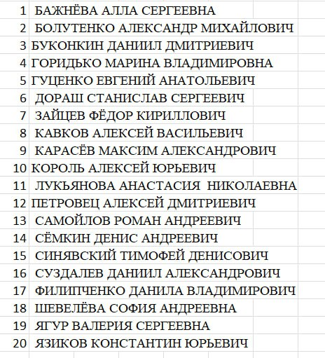

# К сессии

Выполнить ЛР по вариантам.  
Работы на ООП и Windows Forms  
[ЛР](/5th_term/rabota_forms.docx)

!> Первая ЛР обязательна для выполнения  
  Вторая желательна, если нужно больше 4х балов  
  \+ Будет контрольная по ООП, повторить.  
  

!> ⚠️ Список по которому определять вариант. Если нумерация закончилась, то номер варианта определяется циклично с начала.

